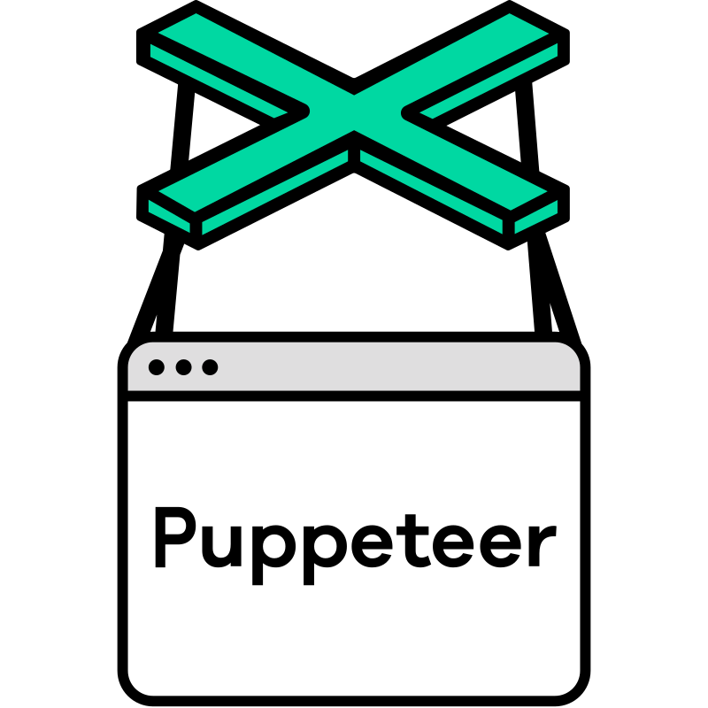

<h1 align="center">
  
</h1>

<h3 align="center">Passionate front-end focused full-stack developer with expertise in front-end technologies like HTML, CSS, Tailwind, TypeScript, and Angular and back-end technologies like Node.js and MongoDB. Always eager to learn and take on new challenges in the tech world.</h3>

<h4 align="center">
  <code><a href="https://www.linkedin.com/in/sm-hemel/" title="LinkedIn Profile"> LinkedIn</a></code>
  <code><a href="https://leetcode.com/smhemel/" title="LeetCode Profile"> LeetCode</a></code>
  <code><a href="https://www.hackerrank.com/SM_HEMEL" title="HackerRank Profile"> HackerRank</a></code>
  <code><a href="https://codeforces.com/profile/sm_hemel" title="Codeforces Profile"> Codeforces</a></code>
  <code><a href="https://www.facebook.com/smhemel.me/" title="Facebook Profile"> Facebook</a></code>
</h4>

### 🧐 More About Me:
- 🔭 &nbsp; <em>Senior Software Engineer at <a href="https://enosisbd.com/">Enosis Solutions
</a></em>
- 🌱 &nbsp; I’m currently learning **back-end technologies**
- 💬 &nbsp; Ask me anything [here](https://github.com/smhemel/smhemel/issues/1)! I am happy to help.
- 📫 &nbsp; Reach me out: **smhemel.eu@gmail.com**
- 📝 &nbsp; Checkout my [Resume](https://www.canva.com/design/DAF4D8dL6QY/rijBTUMeQUS8zIyd_coWlg/view?utm_content=DAF4D8dL6QY&utm_campaign=designshare&utm_medium=link&utm_source=editor)

### My Absolute Favorites:
- 💻 &nbsp; I love exploring new technologies and building cool stuff.
- 📰 &nbsp; Reading, writing & watching Tech Stuff whenever possible.
- 🍕 Love to play cricket and Badminton.

<h2 align="center" id="smhemel-tech">🔥 Languages & Frameworks & Tools & Abilities 🔥</h2>

> Tools and technologies that I have worked with.

<table align="center">
  <tr>
    <td align="center" width="96">
      
       HTML
    </td>
    <td align="center" width="96">
      
       CSS
    </td>
    <td align="center" width="96">
      
       SASS
    </td>
    <td align="center" width="96">
      
       C
    </td>
    <td align="center" width="96">
      
       C++
    </td>
    <td align="center" width="96">
      
       JavaScript
    </td>
    <td align="center" width="96">
      
       TypeScript
    </td>
    <td align="center" width="96"> 
      
       Swift
    </td>
    <td align="center" width="96"> 
      
       Angular
    </td>
  </tr>
  <tr>
    <td align="center"  width="96">
      
       Ionic
    </td>
    <td align="center" width="96">
      
       Bootstrap
    </td>
    <td align="center" width="96">
      
       Tailwind
    </td>
    <td align="center" width="105"> 
      
       Material UI
    </td>
    <td align="center" width="105"> 
      
       Ant Design
    </td>
    <td align="center" width="96"> 
      
       Git
    </td>
    <td align="center" width="96"> 
      
       Github
    </td>
    <td align="center" width="96"> 
      
       Jira
    </td>
    <td align="center" width="96"> 
      
       Postman
    </td>
  </tr>
</table>

> Tools and technologies that I am learning and want to learn.

<table align="center">
  <tr>
    <td align="center" width="96">
      
       NodeJS
    </td>
    <td align="center" width="96">
      
       Postgres
    </td>
    <td align="center" width="96">
      
       Redis
    </td>
    <td align="center" width="105">
      
       Puppeteer
    </td>
    <td align="center" width="105">
      
       Docker
    </td>
    <td align="center" width="96">
      
       Web Socket
    </td>
    <td align="center" width="96">
      
       Go
    </td>
    <td align="center" width="96">
      
       Gin
    </td>
    <td align="center" width="96">
      
       AWS
    </td>
  </tr>
</table>

 
 
<!--  -->

- 🔭 I’m currently working on **Enosis Solutions**

- 🌱 I’m currently learning **back-end technologies**

- 📫 How to reach me **smhemel.eu@gmail.com**
  
- 🙎🏻‍♂️ My Resume - [View](https://www.canva.com/design/DAF4D8dL6QY/rijBTUMeQUS8zIyd_coWlg/view?utm_content=DAF4D8dL6QY&utm_campaign=designshare&utm_medium=link&utm_source=editor)
- 👾 &nbsp; Fun fact: Equal is Not Always Equal in JS.
### Blogs posts
<!-- BLOG-POST-LIST:START -->
<!-- BLOG-POST-LIST:END -->

<h3 align="left">Connect with me:</h3>

<h3 align="left">Languages and Tools:</h3>

                

<!--    -->
  
  

<!-- 

    <a href="https://app.daily.dev/sm_hemel">

 -->

  

